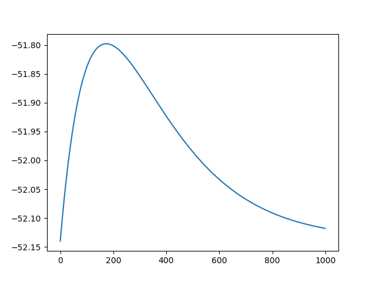
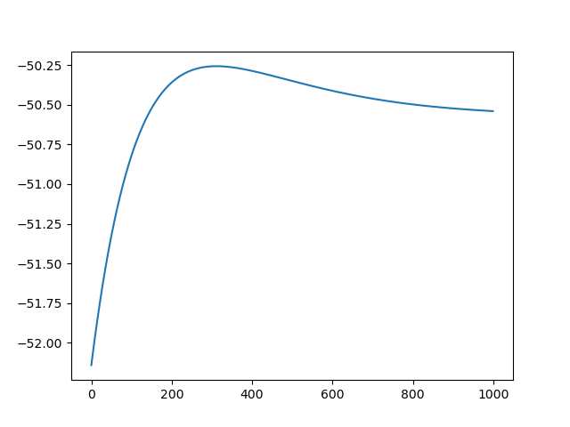
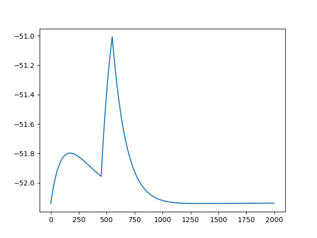

# Neuroscience_Inno2021
Labs for the Neuroscience course

## Morris-Lecar model

I followed equations [here](https://en.wikipedia.org/wiki/Morris%E2%80%93Lecar_model)

I simulated different values for current

Current = 0

Current = 1

Current changing between 0 and 1

